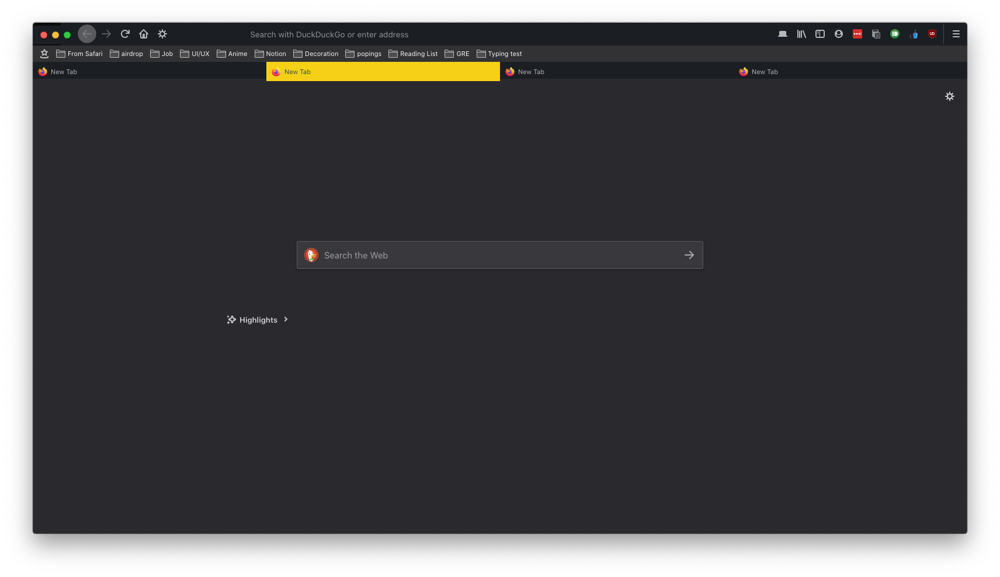

# Looks like safari 

---

## Steps for applying this configuration:

- Type about:profiles into your urlbar and go to the page
- Open the root directory folder specified on the page
- Inside this folder, create a folder named "chrome"
- Put the userchrome.css file from this repo into the chrome folder
- Type about:config into your urlbar and go to the page
- Paste "toolkit.legacyUserProfileCustomizations.stylesheets" into the bar and set its value to true
- Go back to about:profiles and click the restart normally buton
- That should be it!
---
> You may how to adjust some parameters as they are adjusted to my resolution 

